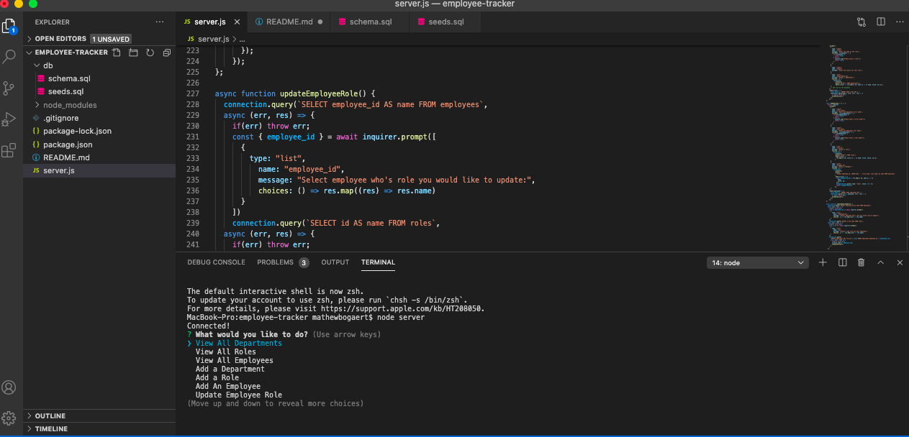

  # Employee Tracker

  ## Description
  This is a generator that tracks employees role, salary, department and other details through the command line.
  
  ## Table of Contents:
  * [Description](#description)
  * [Installation](#installation)
  * [Built With](#built-with)
  * [Repository](#repository)
  * [Usage](#usage)
  * [Contributions](#contributions)
  * [License](#license)

  ## Installation
  First you will clone the respository to your own computer. Then make sure you have node.js, npm, console.table, mysql2 and inquirer installed and running. Run mysql in the terminal and make sure to download the Schema by using the command "source db/schema.sql". Optionally you can also download the seed file if you would like the database to start populated with the command "source db/seeds/sql". Then choose a prompt and follow the questions.

  ## Built With
  Node, JavaScript, NPM, Inquirer, console.table, mysql2

  ## Repository
  [Repository Link](https://github.com/Mbogaert/employee-tracker)

  ## Screenshot
  

  ## Useage
  This project can be used to keep track of employees at a company

  Video on how it works: [Click Here](https://drive.google.com/file/d/1JWl8WgpCQAYRtzZ-kgqekJ1qk914ASnX/view)

  ## Contributions
  Made with Pride by Mathew Bogaert

  ## License
  This application is unlicensed.